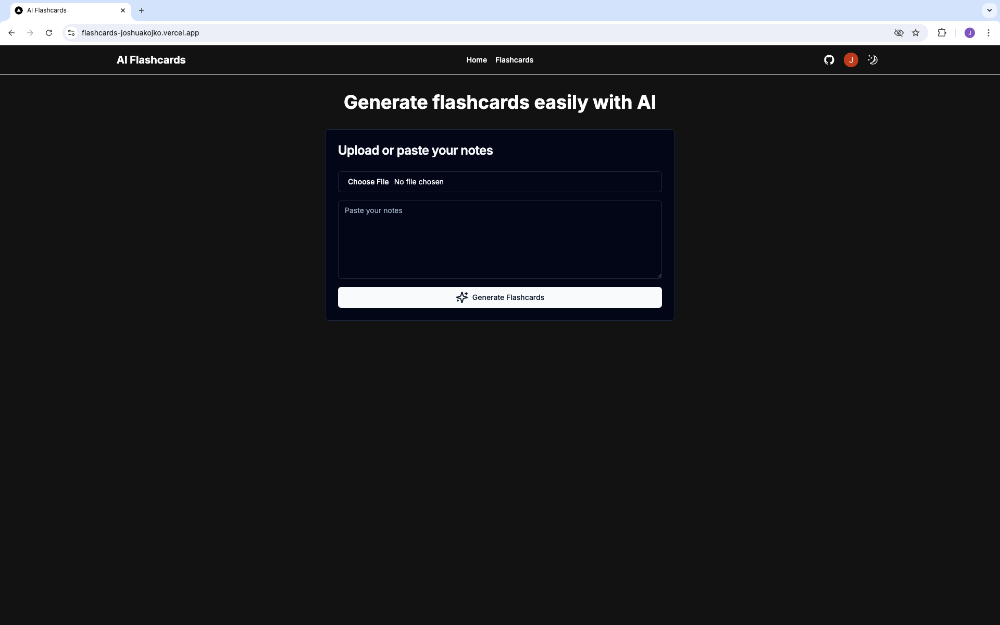
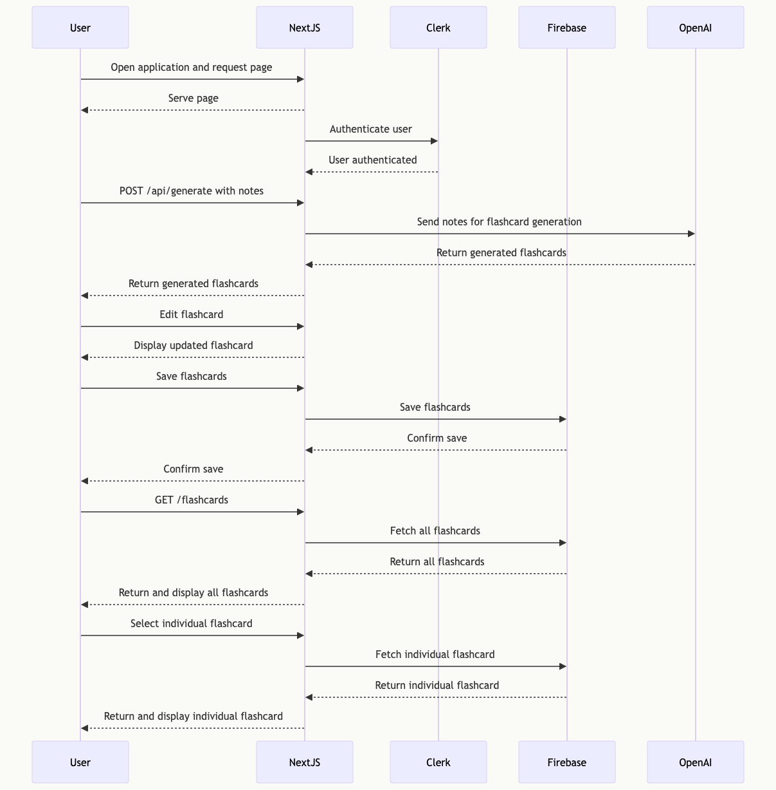

# AI Flashcards



AI Flashcards is an intelligent flashcard creation and management system designed to enhance learning efficiency and retention.

## Features

- **AI-Powered Flashcard Generation**: Create high-quality, engaging flashcards based on your notes or topics.

  - Thought-provoking questions
  - Concise, accurate answers
  - Variety of question types

- **User Management**: Seamless user authentication and management with Clerk.

  - Secure login
  - User-specific flashcard sets

- **Interactive Flashcard Preview**: Review and edit flashcards with an intuitive interface.

  - Carousel view
  - Edit questions and answers
  - Real-time updates

## Tech Stack

- Next.js
- React
- TypeScript
- Shadcn UI
- Clerk for authentication
- Firebase firestore for database
- OpenAI for flashcard generation
- Zod for structured output and schema validation
- Vercel for deployment

## Sequence Diagram



## Getting Started

1. Clone the repository:

   ```bash
   git clone https://github.com/joshuakojko/flashcards.git
   ```

2. Install dependencies:

   ```bash
   npm install
   # or
   yarn install
   # or
   pnpm install
   # or
   bun install
   ```

3. Set up environment variables:
   Copy the .env.test file to .env.local and update the values:

   ```bash
   cp .env.test .env.local
   ```

4. Run the development server:

   ```bash
   npm run dev
   # or
   yarn dev
   # or
   pnpm dev
   # or
   bun dev
   ```

5. Open [http://localhost:3000](http://localhost:3000) with your browser to see the result.

## API Endpoints

### Generate Flashcards

- **Endpoint**: `/api/generate`
- **Method**: `POST`
- **Description**: Generate flashcards based on provided notes.
- **Request Body**:
  ```json
  {
    "notes": "Your notes or topic here"
  }
  ```
- **Response**:
  ```json
  {
    "flashcards": [
      {
        "question": "What is AI?",
        "answer": "AI stands for Artificial Intelligence."
      },
      ...
    ]
  }
  ```